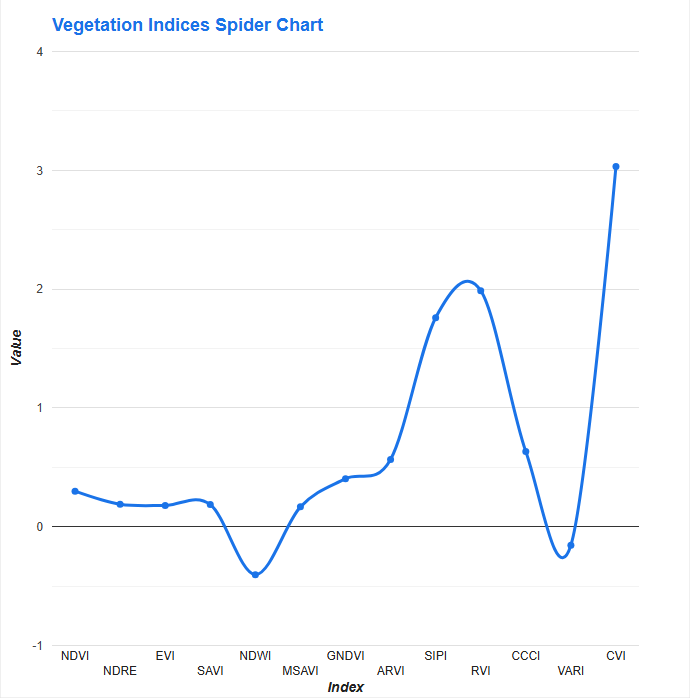
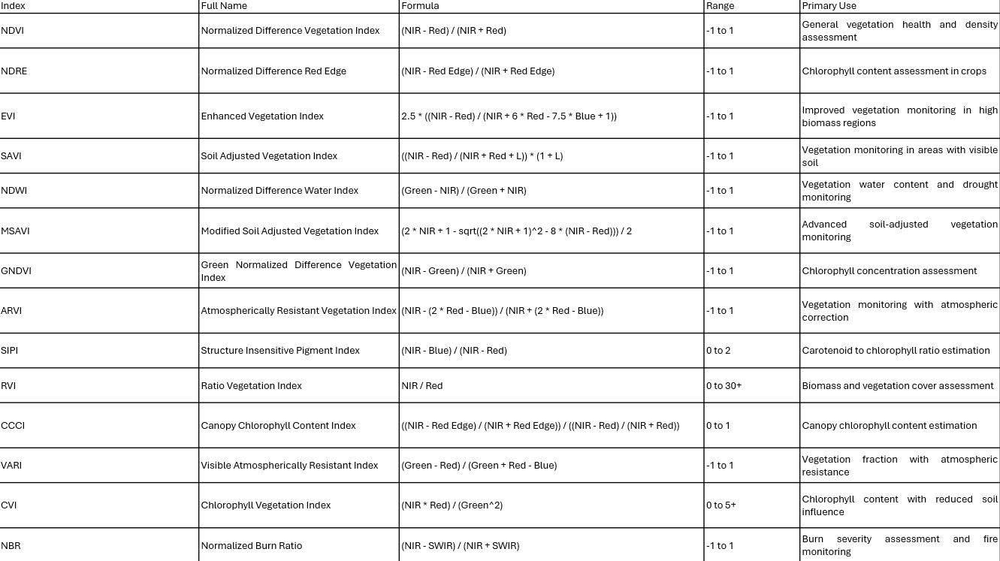
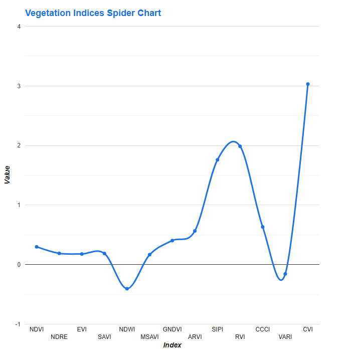
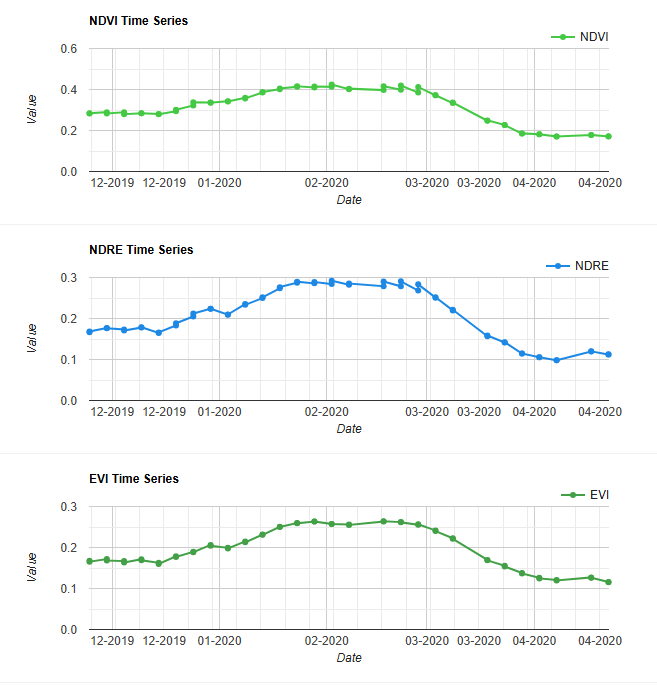
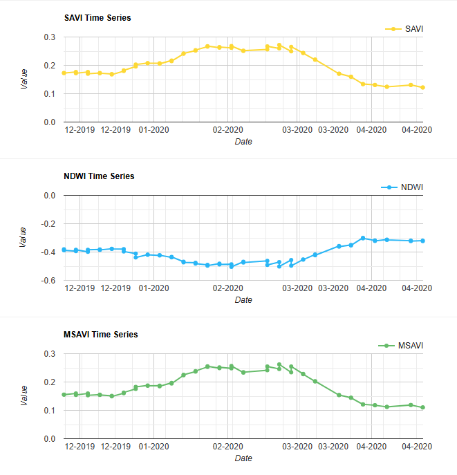
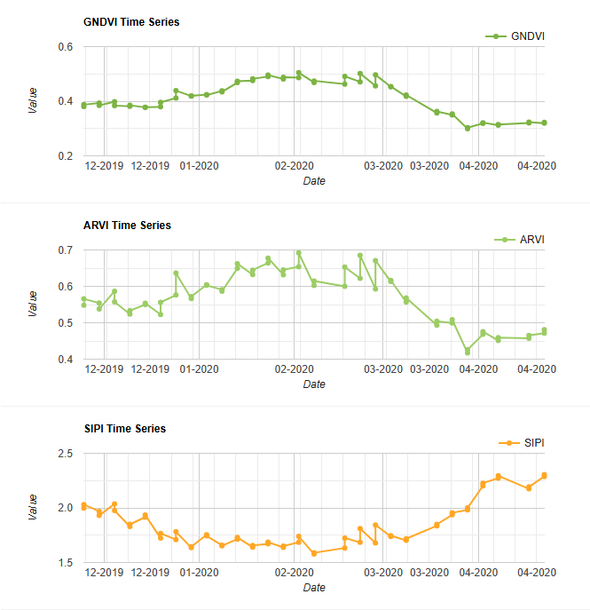
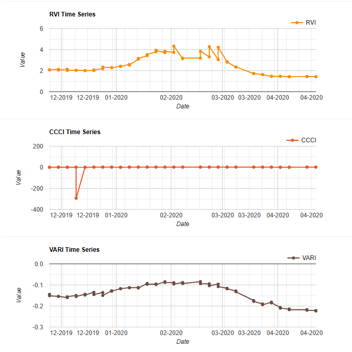
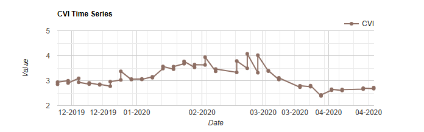
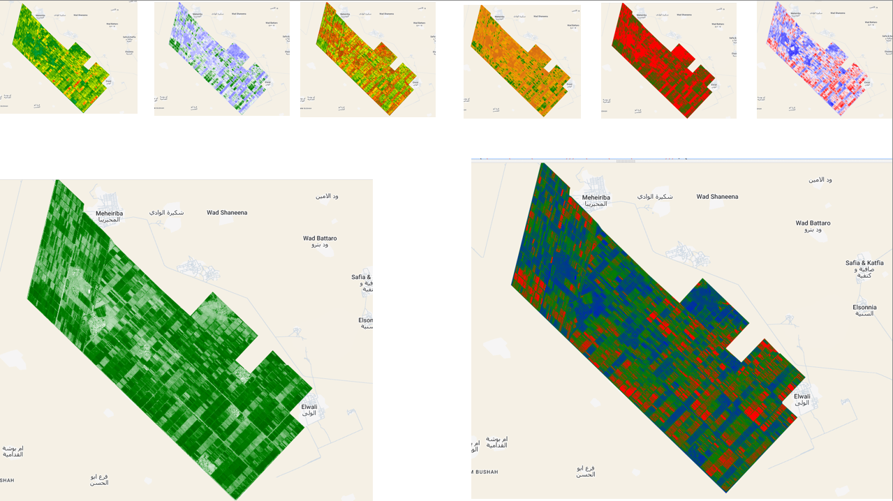

# Sentinel-2-Vegetation-Indices-Analysis-and-Visualization
A comprehensive Earth Engine application for calculating, analyzing, and visualizing multiple vegetation indices using Sentinel-2 satellite imagery. This tool processes satellite data to generate various vegetation indices, enabling advanced agricultural and environmental monitoring.

## Features
* Automated cloud masking for Sentinel-2 imagery
* Calculation of 13 vegetation indices
* Interactive visualization tools:
   * Spider charts for index comparison
   * Time series analysis
   * Custom-colored map layers
* Automated data export functionality to Google Drive
* 10m resolution output

### Prerequisites
* Google Earth Engine account
* Access to Sentinel-2 data collection
* Google Drive for exports
## Setup
* Copy the script to your Earth Engine Code Editor
* Define your region of interest ('gezira' in the code)
* Adjust the date range:

      * var startDate = '2019-11-20';
      * var endDate = '2020-04-25';
# Vegetation Indices Overview

## Vegetation Indices Table

# Output and Export

* Spider chart comparing all indices
* Individual time series charts for each index
* Map layers with customized color schemes
* Exported GeoTIFF files to Google Drive (10m resolution)

